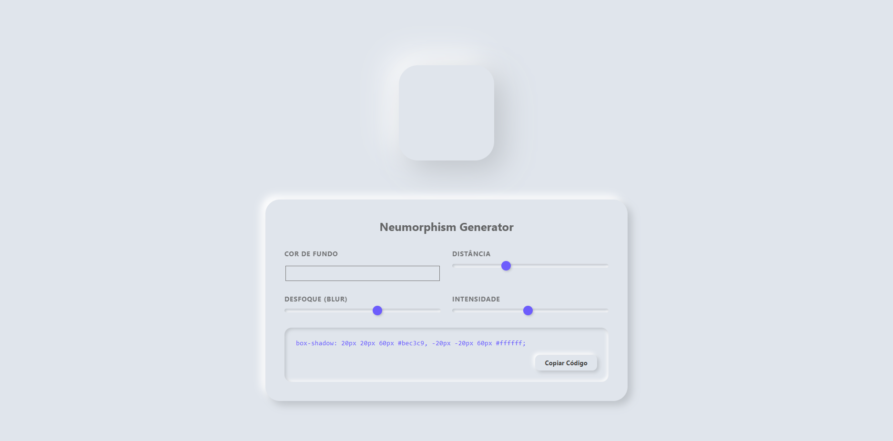

# 🎨 Neumorphism Generator (Soft UI)

📝 **Descrição do Projeto**

Este projeto consiste em um gerador avançado de CSS focado no design **Neumorphism** (ou Soft UI). O objetivo principal é fornecer aos desenvolvedores e designers uma interface intuitiva para criar efeitos de relevo e profundidade em elementos web, eliminando a complexidade de calcular manualmente as sombras clara e escura necessárias para manter a fidelidade visual.

Desenvolvido para simplificar o workflow de design moderno, o sistema permite a customização em tempo real de propriedades como distância, desfoque (blur), intensidade e raio de curvatura. Além disso, conta com um algoritmo inteligente que ajusta automaticamente a luminância das sombras com base na cor de fundo selecionada, garantindo que o efeito neumórfico seja sempre consistente e esteticamente agradável.

🚀 **Tecnologias Utilizadas**

- **Framework:** React 19 (Vite)
- **Estilização:** Tailwind CSS (Modern Engine)
- **Animações:** Framer Motion (para transições suaves e feedback táctil)
- **Ícones:** Lucide React
- **Linguagem:** TypeScript (Garantindo tipagem forte e manutenção segura)

📊 **Resultados e Aprendizados**

O projeto consolidou conhecimentos em manipulação dinâmica de cores e design de sistemas focados na experiência do usuário.

- **Fidelidade Visual:** Implementação de um algoritmo de luminância que garantiu 100% de consistência estética em diferentes tonalidades.
- **Eficiência de Código:** Aplicação de hooks como `useMemo` para evitar re-renderizações desnecessárias durante o arrasto dos sliders.
- **Interatividade:** Criação de componentes customizados (Sliders e Toggles) que respeitam a mesma linguagem visual do sistema.

🔧 **Como Executar**

1. Clone o repositório.
2. Instale as dependências: `npm install`.
3. Inicie o servidor de desenvolvimento: `npm run dev`.
4. Otimize para produção: `npm run build`.

[Voltar ao início] (https://github.com/TaBaRaJa/portfolio-gabriel-coutinho-silva)
